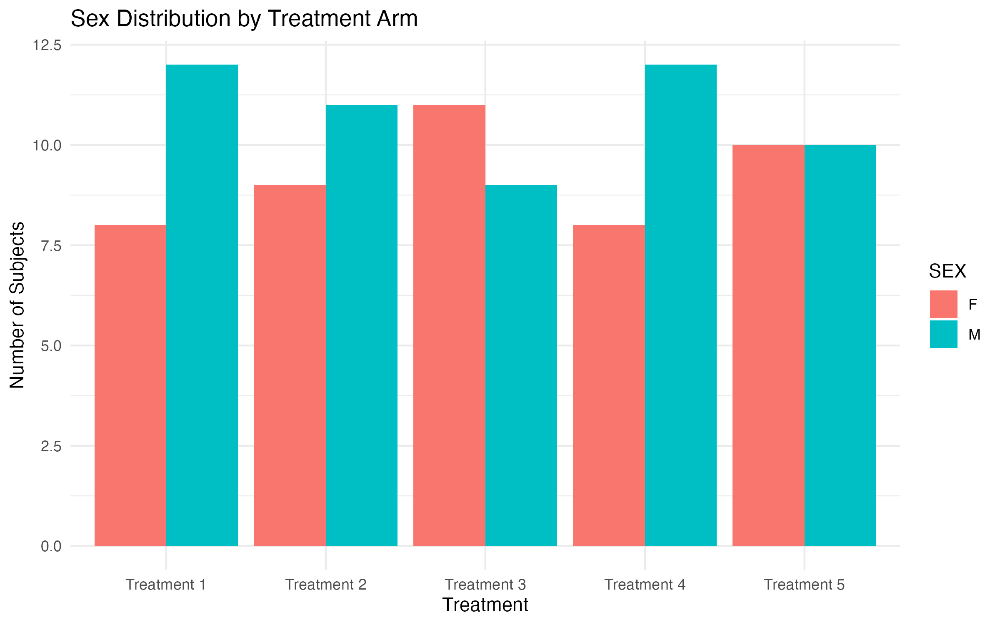
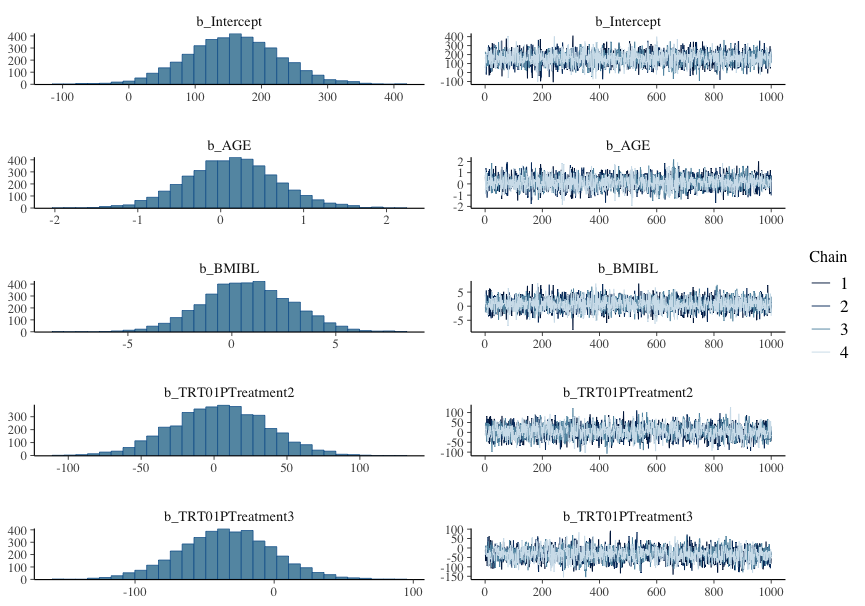

# ADaM Subject-Level Analysis Dataset: Descriptive, Statistical, and Bayesian Analysis

A reproducible R analysis of a simulated **ADaM Subject-Level Analysis Dataset (ADSL)**.

## Project Overview

This project demonstrates an end-to-end analysis of a simulated ADSL dataset using R.

The analysis includes:

* Dataset structure and quality control
* Subject-level demographics
* Treatment-group characteristics
* Baseline variables
* Treatment exposure
* Descriptive statistics
* Data visualization
* Statistical comparisons between treatment groups
* Correlation analysis
* Multivariable linear regression
* Bayesian regression using `{brms}`

The primary outcome investigated in the statistical analyses is **treatment duration (`TRTDURD`)**.

## Data

The dataset is simulated and intended for **educational and portfolio purposes only**. It should not be interpreted as representing an actual clinical trial.

Source: [CDISC Dataset](https://cdiscdataset.com/)

## Key Visualizations

### Sex Distribution by Treatment



### Bayesian Regression



## Analysis Workflow

```text
ADSL
 ↓
Data Structure & QC
 ↓
Demographics & Baseline
 ↓
Treatment Exposure
 ↓
Descriptive Statistics
 ↓
Statistical Analysis
 ↓
Linear Regression
 ↓
Bayesian Regression
```

## Tools

* R
* `{tidyverse}`
* `{brms}`
* `{here}`
* `{ggplot2}`

## Disclaimer

This is a **simulated educational dataset** and the results are not clinical evidence or regulatory analysis.
